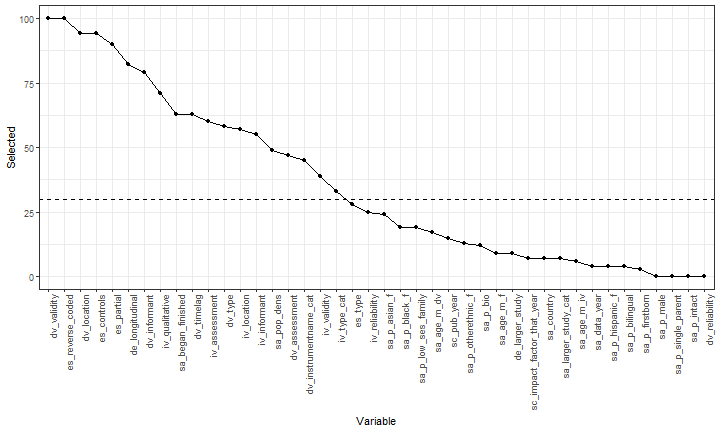

```{r setup, include=FALSE}
knitr::opts_chunk$set(echo = FALSE)
options("kableExtra.html.bsTable" = TRUE)
#author: 
#- Caspar J. van Lissa
#- Nicole Lucassen
#- Renske Keizer

run_everything <- FALSE

if(!run_everything){
  render_graphics <- FALSE
  run_metafor <- FALSE
  run_recursive_metaforest <- FALSE
  run_metaforest <- FALSE
} else {
  render_graphics <- FALSE
  run_metafor <- FALSE
  run_recursive_metaforest <- FALSE
  run_metaforest <- FALSE
}


library(knitr)
library(kableExtra)
library(metaforest)
library(caret)
library(plotly)

# Prep data and authors text labels
analyzedat <- read.csv("imputed_data.csv")
numeric_vars <- c("sc_impact_factor_that_year", "sa_data_year", "sa_approached_participated", "sa_began_finished", "sa_p_male", "sa_p_single_parent", "sa_p_hispanic_f", "sa_p_black_f", "sa_p_asian_f", "sa_p_otherethnic_f", "sa_p_low_ses_family", "sa_p_bilingual", "sa_p_bio", "sa_p_intact", "sa_p_firstborn", "es_controls", "es_correlation", "id_study", "iv_reliability", "dv_timelag", "dv_reliability", "sa_age_m_iv", "sa_age_sd_iv", "sa_age_m_dv", "sa_age_sd_dv", "sa_age_m_f", "sa_age_sd_f", "sc_pub_year", "es_n", "id_row")
categorical_vars <- c("es_reverse_coded", "es_partial", "sc_pub_type", "sa_random", "sa_bias_demographics", "sa_bias_involvement", "sa_bias_language", "sa_country", "sa_pop_dens", "sa_mother", "iv_assessment", "iv_location", "iv_informant", "dv_type", "dv_assessment", "dv_location", "dv_informant", "es_type", "iv_type_cat", "dv_instrumentname_cat", "sa_larger_study_cat", "de_experiment", "de_longitudinal", "de_manipulation", "de_larger_study", "iv_qualitative", "iv_researcher_present", "iv_recording", "iv_validity", "dv_researcher_present", "dv_recording", "dv_validity")

analyzedat[numeric_vars] <- lapply(analyzedat[numeric_vars], as.numeric)
analyzedat[categorical_vars] <- lapply(analyzedat[categorical_vars], as.factor)

authors <- paste(analyzedat$sc_authors, analyzedat$sc_pub_year, sep = ", ")
analyzedat <- analyzedat[, -match("sc_authors", names(analyzedat))]
effect_sizes <- escalc(ri = analyzedat$es_correlation, ni = analyzedat$es_n, measure = "COR")
analyzedat$yi <- as.numeric(effect_sizes$yi)
analyzedat$vi <- as.numeric(effect_sizes$vi)

# Function for formatting stats
nicetext <- function(x, digits = 2){
  if(x%%1==0){
    formatC(x, digits = 0, format = "f")
  } else {
    if(abs(x) <  10^-digits){
      paste0("< ", 10^-digits)
    } else {
      formatC(x, digits = digits, format = "f")
    }
  }
}

# Function to calculate I2
calc_i2 <- function(x) {
  W <- diag(1 / x$vi)
  X <- model.matrix(x)
  P <- W - W %*% X %*% solve(t(X) %*% W %*% X) %*% t(X) %*% W
  outval <- 100 * x$sigma2 / (sum(x$sigma2) + (x$k - x$p) / sum(diag(P)))
  outval <-  c(I2 = (100 * sum(x$sigma2) / (sum(x$sigma2) + (x$k - x$p) / sum(
    diag(P)))), outval)
  names(outval)[c(2, 3)] <- c("Between cluster", "Within cluster")
  outval
}

# Function for interactive funnel plot
funnel_plotlyfi <- function(x, labels = NULL) {
  tau2 <- x$tau2
  weights <- 1 / (x$vi + tau2)
  
  estimate = x$b[1]
  se <- x$se
  
  ses <- sqrt(x$vi)
  
  se.seq = seq(0, max(ses), 0.001)
  
  #Compute vectors of the lower-limit and upper limit values for
  #the 95% CI region
  ll95 = estimate - (1.96 * se.seq)
  ul95 = estimate + (1.96 * se.seq)
  
  #Do this for a 99% CI region too
  ll99 = estimate - (3.29 * se.seq)
  ul99 = estimate + (3.29 * se.seq)
  
  #Confidence interval for summary effect size
  meanll95 = estimate - (1.96 * se)
  meanul95 = estimate + (1.96 * se)
  
  dfCI = data.frame(ll95, ul95, ll99, ul99, se.seq, estimate, meanll95, meanul95)
  dat <-
    data.frame(
      se = ses,
      R = x$yi,
      weights = weights / sum(weights),
      label = labels
    )
  
  #Draw Plot
  fp = ggplot(aes(x = R, y = se), data = dat) +
    geom_point(aes(
      x = R,
      y = se,
      size = weights,
      text = label
    ), shape = 1) +
    ylab('Standard Error') + xlab('R') +
    geom_line(aes(x = ll95, y = se.seq), linetype = 'dotted', data = dfCI) +
    geom_line(aes(x = ul95, y = se.seq), linetype = 'dotted', data = dfCI) +
    geom_line(aes(x = ll99, y = se.seq), linetype = 'dashed', data = dfCI) +
    geom_line(aes(x = ul99, y = se.seq), linetype = 'dashed', data = dfCI) +
    geom_segment(aes(
      x = meanll95,
      y = min(se.seq),
      xend = meanll95,
      yend = max(se.seq)
    ), data = dfCI) +
    geom_segment(aes(
      x = meanul95,
      y = min(se.seq),
      xend = meanul95,
      yend = max(se.seq)
    ), data = dfCI) +
    scale_y_continuous(trans = "reverse",
                       limits = c(max(dat$se), 0),
                       expand = c(0, 0)) +
    scale_x_continuous(breaks = seq(-1.25, 2, 0.25)) +
    guides(size = FALSE) +
    theme_bw()

  ggplotly(fp, tooltip = "text") %>% config(displayModeBar = F)
}


```

## Introduction

Interactions with caregivers drive children's language development<font size="2">  
([Pancsofar & Vernon-Feagans, 2006](https://doi.org/10.1016/j.appdev.2006.08.003))</font>

Fathers play unique role<font size="2">  
([Cabrera & Tamis-LeMonda, 2013](https://books.google.nl/books?hl=en&lr=&id=Xx-abFyPtg8C&oi=fnd&pg=PR1&dq=Cabrera+%26+Tamis-LeMonda,+2013&ots=3migj0STnv&sig=Apy1_13WSyQMw2J0plIdlzlLmuY#v=onepage&q=Cabrera%20%26%20Tamis-LeMonda%2C%202013&f=false); [Varghese & Wachen, 2016](https://doi.org/10.1080/01494929.2015.1099587))</font>

* Through relationship with the mother
* Indirectly, providing resources
* *Directly, through interactions with children*

## Direct involvement

Fathers use more varied/challenging language than mothers<font size="2">  
([Tamis-LeMonda, Baumwell, & Cristofaro, 2012](https://doi.org/10.1177/0142723711419321))</font>

* More clarification requests ("wh- questions")<font size="2">  
([Rowe et al., 2004](https://doi.org/10.1111/j.1467-9507.2004.000267.x))</font>
* Do not adjust conversation topic to child<font size="2">  
([Abkarian et al., 2003](http://www.mensstudies.info/OJS/index.php/FATHERING/article/download/185/pdf_1))</font>

This expands children's vocabulary (zone of proximal development)<font size="2">  
([Pancsofar & Vernon-Feagans, 2010](https://doi.org/10.1016/j.ecresq.2010.02.001))</font>

## Previous meta-analysis

Correlation between fathers' direct involvement and children's language outcomes

* Previous meta-analysis covered studies until 2008<font size="2">  
([McWayne, Downer, Campos, & Harris, 2013](https://doi.org/10.1080/10409289.2013.746932))</font>
* Average correlation: .08 (5 effect sizes)

**Recently: burgeoning interest in fatherhood!**

Time to update this estimate

## Moderators

Meta-analysis intended to summarize highly similar studies

Often (ab?)used to summarize diverse bodies of research

Differences between studies can be coded as moderators

Problem with classic meta-regression:

* Lacks power to identify relevant moderators
* Overfitting
* Forget about including interactions!

## Metaforest

Machine-learning based technique to identify relevant moderators

High power with as few as 20 studies

Controls overfitting

Accounts for interactions and non-linear effects

[Van Lissa, 2017](https://osf.io/khjgb/)


## Methods

Electronic databases:

* Web of Science
* PsychInfo
* ERIC

Articles screened: 7185

Relevant articles: 144

Of these, `r max(analyzedat$id_study)` reported a total of `r nrow(analyzedat)` correlation coefficients

## Dataset

Observed effect sizes ranged from `r nicetext(range(analyzedat[["es_correlation"]])[1])` to `r nicetext(range(analyzedat[["es_correlation"]])[2])`  
$M_r = `r nicetext(mean(analyzedat[["es_correlation"]]))`$, $SD = `r nicetext(sd(analyzedat[["es_correlation"]]))`$

Sample sizes ranged from `r min(analyzedat[["es_n"]])` to `r max(analyzedat[["es_n"]])`  
$M_n = `r nicetext(mean(analyzedat[["es_n"]]))`$, $SD = `r nicetext(sd(analyzedat[["es_n"]]))`$

Several studies reported multiple effect sizes (`r min(table(analyzedat[["id_study"]]))` to `r max(table(analyzedat[["id_study"]]))`


## Standard meta-analysis

```{r metafor_analysis, include=FALSE}
if(run_metafor){
  #Conduct meta-analyses
  model.full <- rma.mv(yi, vi, random = list(~ 1 | id_study, ~ 1 | id_row), data=analyzedat) 
  model.within_null <- rma.mv(yi, vi, random = list(~ 1 | id_study, ~ 1 | id_row), sigma2=c(NA,0), data=analyzedat) 
  model.between_null <- rma.mv(yi, vi, random = list(~ 1 | id_study, ~ 1 | id_row), sigma2=c(0,NA), data=analyzedat) 
  model.both_null <- rma.mv(yi, vi, random = list(~ 1 | id_study, ~ 1 | id_row), sigma2=c(0,0), data=analyzedat) 
  
  aov_within <- anova(model.full,model.within_null) 
  aov_between <- anova(model.full,model.between_null) 
  aov_bothnull <- anova(model.full,model.both_null) 
  aov_table <- rbind(
  c(df=aov_between$p.f, aov_between$fit.stats.f[c(3:4, 1)], LRT = NA, p = NA),
  c(df=aov_within$p.r, aov_within$fit.stats.r[c(3:4, 1)], LRT = aov_within$LRT, p = aov_within$pval),
  c(df=aov_between$p.r, aov_between$fit.stats.r[c(3:4, 1)], LRT = aov_between$LRT, p = aov_between$pval),
  c(df=aov_bothnull$p.r, aov_bothnull$fit.stats.r[c(3:4, 1)], LRT = aov_bothnull$LRT, p = aov_bothnull$pval)
  )
  rownames(aov_table) <- c("Three-level model", "Within-studies variance constrained", "Between-studies variance constrained", "Both variance components constrained")
  aov_table[,-c(1,6)] <- formatC(aov_table[,-c(1,6)], digits = 2, format = "f")
  aov_table[,6] <- formatC(as.numeric(aov_table[,6]), digits = 3, format = "f")
  aov_table[1, 5:6] <-""
  write.csv(aov_table, "table_variance_components.csv")
  confints <- confint(model.full)
  save(model.full, aov_table, confints, file = "metafor_results.RData")
  # Check convergence of variance components:
  #par(mfrow=c(2,1))
  #plot.profile1 <- profile(model.full, sigma2=1)
  #plot.profile2 <- profile(model.full, sigma2=2)
} else {
  load("metafor_results.RData")
  i2s <- calc_i2(model.full)
}


```

Multilevel meta-analysis for dependent effect sizes<font size="2">  
([Van den Noortgate et al., 2013]())</font>

**Overall effect size:**

$\hat{\rho} = `r nicetext(model.full[["b"]][1])`$, 95\% CI [`r nicetext(model.full[["ci.lb"]])`, `r nicetext(model.full[["ci.ub"]])`]

**Tests for residual heterogeneity**

* $Q(`r nrow(analyzedat)-1`) = `r nicetext(model.full[["QE"]])`, p = `r nicetext(model.full[["QEp"]])`$
* Total $I^2 = `r paste0(nicetext(i2s[1]), "\\%")`$
* Between studies: $I^2_b = `r paste0(nicetext(i2s[2]), "\\%")`$
* Within studies: $I^2_w = `r paste0(nicetext(i2s[3]), "\\%")`$

## Publication bias

```{r pub_bias, fig.align='center', warning = FALSE} 
beggs <- regtest(x = analyzedat$yi, vi = analyzedat$vi)

#file drawer analysis (fail and safe)
filedrawer <- fsn(yi = analyzedat$yi, vi = analyzedat$vi)

funnel_plotlyfi(model.full, authors)

```

Funnel plot asymmetry test: $z = `r nicetext(beggs[["zval"]])`, p = `r nicetext(beggs[["pval"]])`$

File drawer analysis: $K = `r filedrawer[["fsnum"]]`$

# Moderator analyses

## Metaforest analysis

Metaforest analysis  
([R-package by Van Lissa, 2017](https://cran.r-project.org/package=metaforest))

Dependent effect sizes: Clustered bootstrapping

Unbiased prediction error: Two parallel forests (10.000 trees)<font size="2">  
([Janitza, Celik, & Boulesteix, 2016](https://doi.org/10.1007/s11634-016-0276-4))</font>

## Recursive pre-selection

**Problem:** Large number of potential moderators (60)

**Solution:** Recursive pre-selection; 100 replications

Algorithm:

1. Start with all moderators
2. Conduct random-effects metaforest, with 2000 trees
3. **If** no moderators have negative importance values, or only one moderator, return the resulting model  
   **Else**, drop the variable with most negative variable importance, go back to Step 2

Retained moderators selected in 30\%+ of replications


## Recursive pre-selection results

```{r recursive_metaforest, include = FALSE}
if(run_recursive_metaforest) {
  moderators <-
  c(
  "sc_pub_year",
  "sc_impact_factor_that_year",
  "sa_data_year",
  "sa_began_finished",
  "sa_age_m_iv",
  "sa_age_m_dv",
  "sa_p_male",
  "sa_age_m_f",
  "sa_p_single_parent",
  "sa_country",
  "sa_p_hispanic_f",
  "sa_p_black_f",
  "sa_p_asian_f",
  "sa_p_otherethnic_f",
  "sa_p_low_ses_family",
  "sa_p_bilingual",
  "sa_pop_dens",
  "sa_p_bio",
  "sa_p_intact",
  "sa_p_firstborn",
  "de_longitudinal",
  "de_larger_study",
  "iv_qualitative",
  "iv_assessment",
  "iv_location",
  "iv_informant",
  "iv_reliability",
  "iv_validity",
  "dv_type",
  "dv_assessment",
  "dv_location",
  "dv_informant",
  "dv_timelag",
  "dv_reliability",
  "dv_validity",
  "es_reverse_coded",
  "es_type",
  "es_partial",
  "es_controls",
  "iv_type_cat",
  "dv_instrumentname_cat",
  "sa_larger_study_cat"
  )
  
  mfdat <- analyzedat[, c("id_study", "yi", "vi", moderators)]
  
  replications <- 100
  
  #Save seeds
  set.seed(3436)
  seeds <- round(runif(replications, 0, 10000000))
  while (length(unique(seeds)) < replications) {
    addseeds <- replications - length(unique(seeds))
    seeds <- c(unique(seeds), round(runif(addseeds, 0, 10000000)))
  }
  
  
  recursive_mf <- function(modvars) {
    mf_tmp <-
      ClusterMF(
        as.formula(paste0("yi ~ ", paste(modvars, collapse = " + "))),
        data = mfdat,
        study = "id_study",
        whichweights = "random",
        num.trees = 2000
      )
    if ((!any(mf_tmp$forest$variable.importance < 0)) | (length(mf_tmp$forest$variable.importance) == 1)) {
      return(mf_tmp)
    } else {
      recursive_mf(names(mf_tmp$forest$variable.importance)[-which(
        mf_tmp$forest$variable.importance == min(mf_tmp$forest$variable.importance))]
        )
    }
  }
  
  master_list <- lapply(seeds, function(rep) {
    set.seed(rep)
    recursive_mf(moderators)
  })
  
  save(master_list, file = "recursive_mf_100_manual_preselection.RData")
  
  var_selected <- sapply(moderators, function(this_mod) {
    sum(sapply(master_list, function(x) {
      this_mod %in% names(x$forest$variable.importance)
    }))
  })
  save(var_selected, file = "var_selected_100.RData")
  
  write.csv(data.frame(Variable = names(var_selected), Frequency = var_selected), "var_selected_100.csv", row.names = FALSE)
  #load("var_selected_100.RData")
  
  moderators <- c(names(var_selected)[var_selected > 30], "id_study", "vi")
  
  # Run model tuning
  X <- analyzedat[moderators]
  set.seed(753) #set seeds to a random number

  # Set up 10-fold grouped CV
  fit_control <- trainControl(method = "cv", index = groupKFold(analyzedat$id_study, k = 10))
  
  # Set up a custom tuning grid for the three tuning parameters of MetaForest
  rf_grid <- expand.grid(whichweights = c("random", "fixed", "unif"),
                         mtry = c(2, 4, 6),
                         min.node.size = c(2, 4, 6))
  
  # Train the model
  cv.mf.cluster <- train(y = analyzedat$yi, x = X,#from x remove yi and each
                         study = "id_study", method = ModelInfo_mf(),
                         trControl = fit_control,
                         tuneGrid = rf_grid, num.trees = 10000)
  
  save(cv.mf.cluster, file = "metaforest_preselected_100_output.RData")
  write.csv(cv.mf.cluster[["results"]], "cv_mf_results.csv", row.names = FALSE)
  
  png("convergence.png", width = 720, height = 432, units = "px")
  plot(cv.mf.cluster$finalModel)
  dev.off()  

  png("var_imp.png", width = 720, height = 432, units = "px")
  VarImpPlot(cv.mf.cluster$finalModel)
  dev.off()

  plot_vars <- cv.mf.cluster$finalModel$forest$variable.importance[cv.mf.cluster$finalModel$forest$variable.importance > 0]
  plot_vars <- names(plot_vars)[order(plot_vars, decreasing = TRUE)]

  png("partial_dep_1.png", width = 720, height = 432, units = "px")
  PartialDependence(cv.mf.cluster$finalModel, plot_vars[1:6])
  dev.off()

  png("partial_dep_2.png", width = 720, height = 432, units = "px")
  PartialDependence(cv.mf.cluster$finalModel, plot_vars[7:length(plot_vars)])
  dev.off()
  
  recursive_plot <- ggplot(data.frame(Variable = factor(names(var_selected)[order(var_selected, decreasing = TRUE)],
                                                        levels = names(var_selected)[order(var_selected, decreasing = TRUE)]),
                                      Selected = var_selected[order(var_selected, decreasing = TRUE)]),
                           aes(x = Variable, y = Selected))+
    geom_point() +
    geom_line(group = 1)+
    theme_bw()+
    theme(axis.text.x = element_text(angle = 90, hjust = 1)) +
    geom_hline(yintercept = 30, linetype = 2)
  png("recursive_selected.png", width = 720, height = 432, units = "px")
  recursive_plot
  dev.off()
  
} else {
  cv.mf.cluster <- list()
  cv.mf.cluster[["results"]] <- read.csv("cv_mf_results.csv")
  var_selected <- read.csv("var_selected_100.csv")

}

```
```{r table_vars}
table_mods <- unique(sapply(var_selected$Variable, substr, 1, 2))
table_mods <- data.frame(Category = table_mods, 
                           "Selected" = sapply(table_mods, function(x){
                                          paste(
                                            sapply(var_selected$Variable[grepl(paste0("^", x), var_selected$Variable) & var_selected$Frequency > 30], function(i){gsub("(^\\w{2}_|_)", " ", i)}), collapse = ",")
  }),
  "Dropped" = sapply(table_mods, function(x){
                                          paste(
                                            sapply(var_selected$Variable[grepl(paste0("^", x), var_selected$Variable) & var_selected$Frequency <= 30], function(i){gsub("(^\\w{2}_|_)", " ", i)}), collapse = ",")
  })
)

row.names(table_mods) <- NULL
table_mods %>%
  knitr::kable(format = "html") %>%
  kable_styling("striped", font_size = 18)#font_size = 18, 
```

## Recursive pre-selection, full results



## Model tuning

Finding optimal analysis settings

* 10-fold (clustered) cross-validation
* Settings considered:
    + Weights ("random", "fixed", "uniform"),
    + Candidate variables (2, 4, 6)
    + Min. node size = (2, 4, 6)
* Select model with smallest prediction error (RMSE)

Optimal model: `r grep(cv.mf.cluster$results$whichweights[which.min(cv.mf.cluster$results$RMSE)], c("uniform", "fixed effects", "random effects"), value = TRUE)` weights, `r cv.mf.cluster$results$mtry[which.min(cv.mf.cluster$results$RMSE)]` candidate variables, min node size `r cv.mf.cluster$results$min.node.size[which.min(cv.mf.cluster$results$RMSE)]`


## Results

Cross-validated $R^2_{cv} = `r nicetext(cv.mf.cluster[["results"]][["Rsquared"]][which.min(cv.mf.cluster[["results"]][["RMSE"]])])`$

Clear evidence of model convergence:


## Variable importance

Contribution to predictive performance; encompasses interactions/non-linear effects


## Bivariate marginal associations 1/2

"Main effects", averaging over all other predictors


## Bivariate marginal associations 2/2


## Conclusions

<font size="4">**Substantive**

* Association might be stronger than thought before (.11 vs .08)
* Which aspects of children's language do fathers influence?<font size="2">  
([Cabrera & Tamis-LeMonda, 2013](https://books.google.nl/books?hl=en&lr=&id=Xx-abFyPtg8C&oi=fnd&pg=PR1&dq=Cabrera+%26+Tamis-LeMonda,+2013&ots=3migj0STnv&sig=Apy1_13WSyQMw2J0plIdlzlLmuY#v=onepage&q=Cabrera%20%26%20Tamis-LeMonda%2C%202013&f=false))</font>
* Stronger effects for **generative-** than **receptive** language

**Methodological**

* Research at home > Lab/school (ecological validity?)
* Assessments/observations > questionnaires
* Trained researchers > parent/self-reports

**Statistical**

* Cross-sectional > longitudinal (dissipation over time)
* High dropout rate: Higher effect size (selection effect)
* Partial correlations tend to be stronger (phacking?)
</font>

## Implications for adolescence

Fathers continue to be relevant, outcome variables change

E.g., father involvement associated with adolescents' academic achievement<font size="2">  
([Meta-analysis by Jeynes, 2014](http://sci-hub.tw/10.1177/0042085914525789))</font>

Important to account for moderators in meta-analysis

MetaForest is a powerful technique to explore between-study heterogeneity

## Further information

All data and syntax on [https://osf.io/dz39y/](https://osf.io/dz39y/)

This presentation live at [https://cjvanlissa.github.io/meta_fathers](https://cjvanlissa.github.io/meta_fathers)
